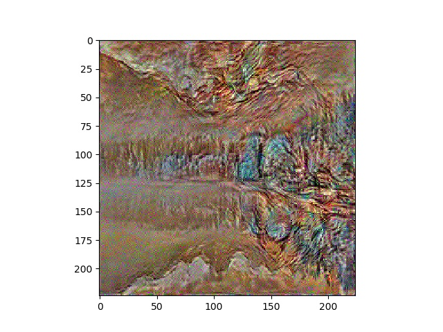

# Image-Style-Transfer
Based on paper **Image Style Transfer Using Convolutional Neural Network**, my own naive implementation.

Use command ***python StyleTransfer -c content_picture_name -s style_picture_name*** to run 

Some examples:

  

